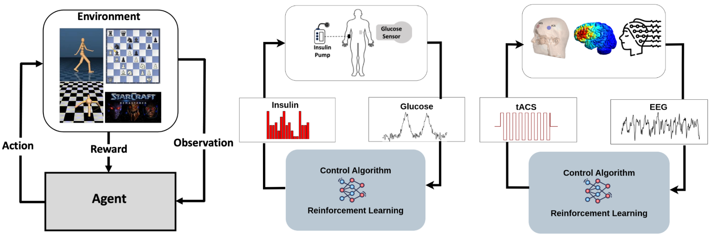

# Chirath Hettiarachchi

Machine learning researcher working on **sequential decision-making, scientific ML, and computational methods for biomedical systems**.

I build learning and simulation systems for complex biological dynamics, including reinforcement learning for closed-loop insulin delivery and neuromodulation.

## Selected work

- **[NeuroStimEnv](https://github.com/chirathyh/neurostimenv)** — biophysical neural simulation + EEG + transcranial stimulation + reinforcement learning.
- **[RL4T1D](https://github.com/RL4H/RL4T1D)** — research infrastructure for reinforcement learning in Type 1 Diabetes.
- **[G2P2C](https://github.com/RL4H/G2P2C)** — reinforcement learning with glucose prediction and planning for automated insulin delivery.
- **[GluCoEnv](https://github.com/RL4H/GluCoEnv)** — simulation environment for RL-based glucose control.

**Research:** Reinforcement Learning · Sequential Decision-Making · Scientific ML · Dynamical Systems · Computational Neuroscience

[Website](https://chirathyh.github.io/) · [Google Scholar](https://scholar.google.com/citations?user=gvLLPs8AAAAJ&hl=en) · [LinkedIn](https://www.linkedin.com/in/chirathyh/)
